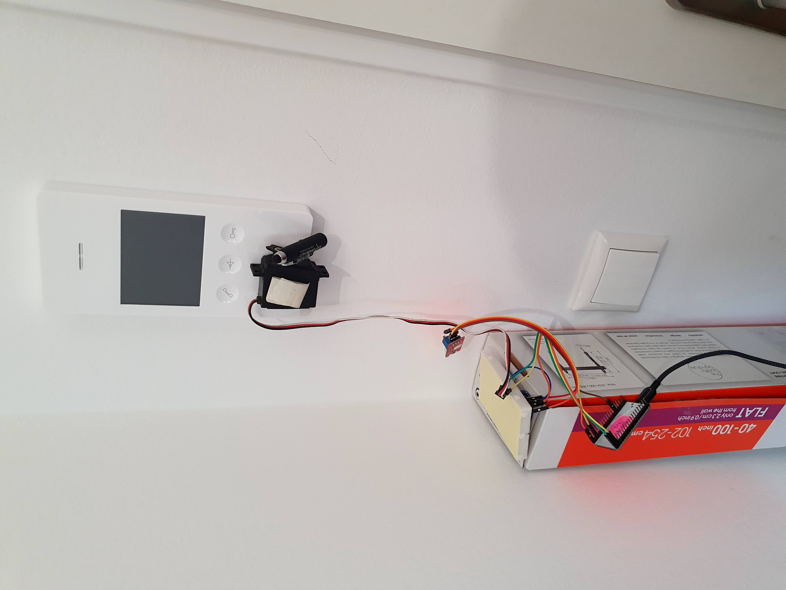

# DIY Nuki Opener

This is a quick weekend project to build a [NUKI Opener](https://nuki.io/en/opener/) like device that does not need any modification of an existing bell system and even works with capacitive buttons.

## Demo

## How does it work?

### Hardware

I have used the following hardware:

- [ESP32 Node MCU 32S](https://www.amazon.de/dp/B07TXNK6P1) Dev Board (any ESP32 board should work)
- [Sound Sensor LM393](https://www.conrad.de/de/p/iduino-1485297-mikrofon-schallsensor-1-st-1485297.html)
- A generic Servo Motor
- some Hot Glue and double sided tape
- Cables to connect everything

#### Building it

The Hardware Setup is pretty basic, I just taped the servo to my ring system and hot glued a pencil, made to control touch screens, onto the lever.
Then I connected the servo and sound sensor power and ground wires, as well as the two data lines (analog output of sound sensor board) to the ESP32.
That's all it needs. 🎉

### Software

On the ESP32 board is a webserver running that exposes two endpoints. `/open` to trigger the servo-open movement directly and `/ring_to_open` that waits for a given interval to detect a loud sound e.g. ringing of the bell and only then trigger the servo.
With the second endpoint, I managed to build a simple [HomeAssistant](https://www.home-assistant.io/) automation that get's triggered as soon as I (actually my phone) get to a predefined location. From now on, I just need to ring my bell to get in.

The Software does not contain any security features, because it's not designed to be exposed directly to the internet. If you want to do so, you should add some sort of authentication and HTTPS support (I would recommend nginx for that).

#### Flashing Software

1. Set up your Arduino IDE to be able to flash scripts to your ESP32
2. Install `ESP32Servo` library from Arduino library manager
3. Adjust Parameters in [Arduino-File](./ring-press/ring-press.ino)
4. Flash Software to ESP32 (after the initial flash, you can use [Arduino OTA](https://arduino-esp8266.readthedocs.io/en/latest/ota_updates/readme.html))

## Room for Improvements

- [ ] The ring detection isn't the most accurate implementation. It is fairly easy to be triggered on accident by other loud sounds at your home, like a vacuum robot. This could ideally be solved by just wiring up the loudspeaker of the intercom system directly to the ESP instead of the passive detection using a microphone. I just didn't feel modifying my intercom system for this prototype.
